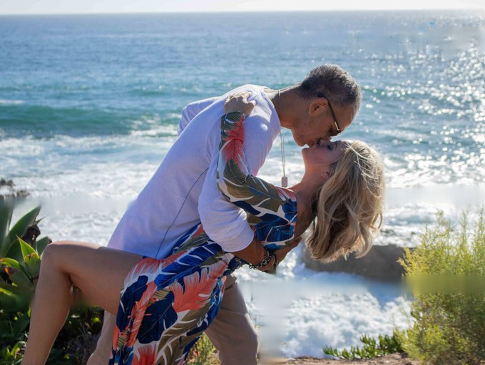

# TF2 Implementation of "Free-Form Image Inpainting with Gated Convolution"

<!-- > :memo: Add a badge for the ArXiv identifier of your paper (arXiv:YYMM.NNNNN) -->

[](https://arxiv.org/abs/1806.03589)

This repository is the unofficial implementation of the following paper.

* Paper title: [Free-Form Image Inpainting with Gated Convolution](https://github.com/JiahuiYu/generative_inpainting/)

## Description

The official TF1 implementation could be found at [JiahuiYu/generative_inpainting](https://github.com/JiahuiYu/generative_inpainting/).

## History

<!-- > :memo: Provide a changelog. -->

- 200817: add docs

## Maintainers

<!-- > :memo: Provide maintainer information.   -->

* Dejia Xu ([@ir1d](https://github.com/ir1d))

## Requirements

[](https://github.com/tensorflow/tensorflow/releases/tag/v2.2.0)
[](https://www.python.org/downloads/release/python-360/)

Different from the official implementation, you don't have to install neuralgym.

## Results





## Dataset

Please follow the [instructions by the authors](https://github.com/JiahuiYu/generative_inpainting/) to obtain the dataset.

The provided model is trained on Places2 dataset. All images are resized to 256x256.

## Training

* Prepare training images filelist and shuffle it ([example](https://github.com/JiahuiYu/generative_inpainting/issues/15)).
    * Modify [inpaint.yml](/inpaint.yml) to set DATA_FLIST, LOG_DIR, IMG_SHAPES and other parameters.
    * Run `python train.py`.

## Evaluation

* Run `python test.py --image examples/input.png --mask examples/mask.png --output examples/output.png --checkpoint model_logs/your_model_dir`.

## License

CC 4.0 Attribution-NonCommercial International

The software is for educational and academic research purposes only.

## Citing
```
@article{yu2018generative,
  title={Generative Image Inpainting with Contextual Attention},
  author={Yu, Jiahui and Lin, Zhe and Yang, Jimei and Shen, Xiaohui and Lu, Xin and Huang, Thomas S},
  journal={arXiv preprint arXiv:1801.07892},
  year={2018}
}

@article{yu2018free,
  title={Free-Form Image Inpainting with Gated Convolution},
  author={Yu, Jiahui and Lin, Zhe and Yang, Jimei and Shen, Xiaohui and Lu, Xin and Huang, Thomas S},
  journal={arXiv preprint arXiv:1806.03589},
  year={2018}
}
```
